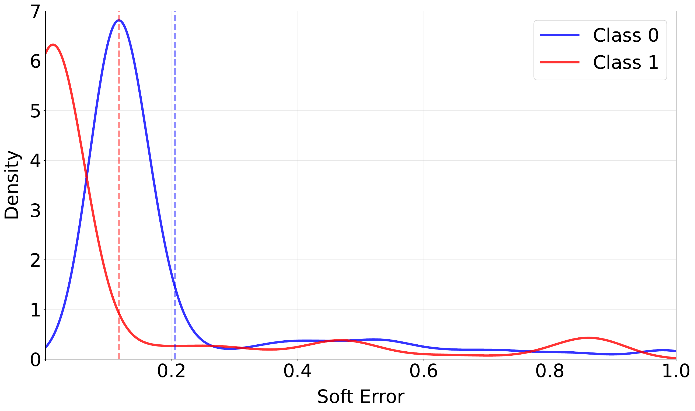
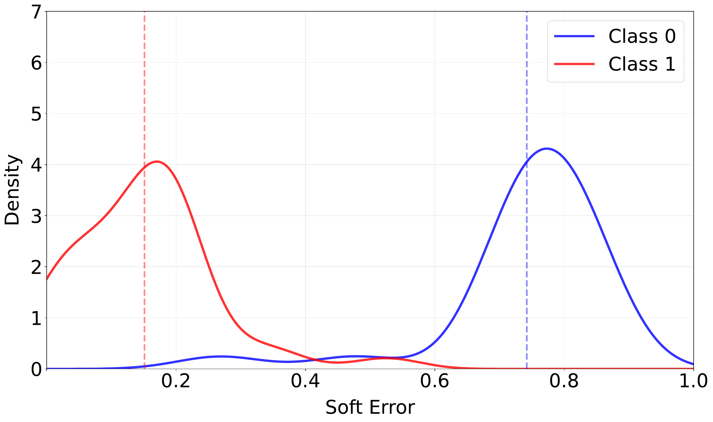
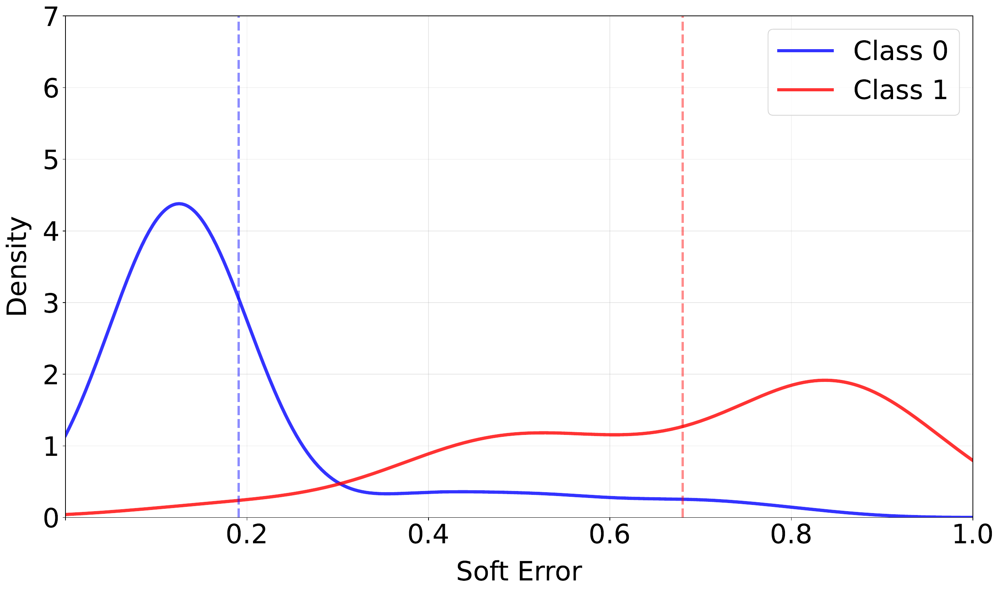
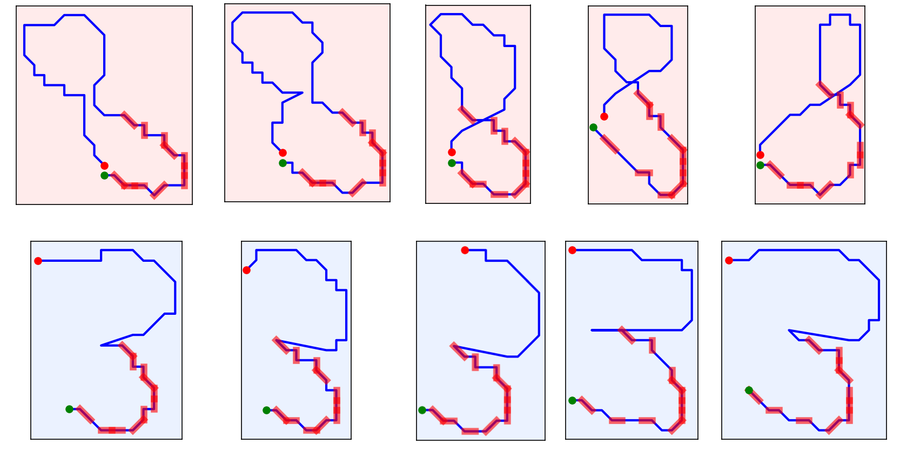
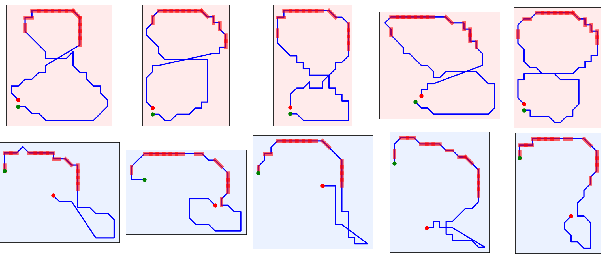

# ConSequence - Contrastive Sequential Slice Discovery

Code from the article **Constrast Slice Discovery on Sequential Data**.

> ConSequence is a framework for contrast slice discovery, which identifies subgroups where a model performs well on one class but poorly on another. It discovers interpretable contrast slices from sequential patterns using Monte Carlo Tree Search (MCTS), enabling post hoc, model-agnostic analysis of sequential models.


*ConSequence is heavily inspired by and extends the g[MCTSExtent algorithm proposed by Mathonat, R et al.](https://doi.org/10.1007/s10115-020-01523-7) It adapts the quality measure to tailor constrast slice discovery.*


Let's take a trained model that classifies handwritten 3s and 8s. It takes as a input stroke-level sequences and must predict the number. Upon analysis of the error distributions per class, we find the following graph:


<p align="center">
  
</p>

However, after running ConSequence, we find slices whose error distributions differ significantly per class:


<center>
<table>
  <tr>
    <td align="center">
      
    </td>
    <td align="center">
      
    </td>
  </tr>
</table>
</center>

Furthermore, if we analyse some slices by plotting the sequential pattern on top of the handwritten digit (in red), is it possible to see style biases per class, i.e., ways of writing either an 8 or 3 that results in the model mixing one class with another.

<center>
<table>
  <tr>
    <td align="center">
      
      <br>
      The 8s have a soft error rate of 0.680, whereas the 3s have 0.191.
    </td>
    <td align="center">
      
      <br>
      The 8s have a soft error rate of 0.083, whereas the 3s have 0.740.
    </td>
  </tr>
</table>
</center>

## Setup

- Install Python 3.8.10+;
- Install the dependencies with `pip install -r requirements.txt`

## Input files

ConSequence takes as an input the train file(s) from the model, together with the true class and class prediction probability (confidence) per data point. For example:

```csv
sequence,y_true,confidence
0 -1 NE_1_1 -1 E_1_0 -1 E_1_0 -1 SE_1_1 -1 E_1_0 -1 E_1_0 -1 E_1_0 -1 S_0_1 -1 S_0_1 -1 S_0_1 -1 S_0_1 -1 SW_1_1 -1 SE_1_1 -1 E_1_0 -1 SE_1_1 -1 E_1_0 -1 SE_1_1 -1 SE_1_1 -1 SE_1_1 -1 S_0_1 -1 S_0_1 -1 S_0_1 -1 S_0_1 -1 SW_1_1 -1 W_1_0 -1 SW_1_1 -1 W_1_0 -1 W_1_0 -1 W_1_0 -1 W_1_0 -1 NW_1_1 -1 W_1_0 -1 NW_1_1 -1 W_1_0 -1 W_1_0 -1 NW_1_1 -1 W_1_0 -1 NW_1_1 -1 STAY_0_0 -2,0,0.0950275
```

Each sequence must be formatted in the Kosarak format, where `y_true` is either 0 or 1, like below:

```
y_true -1 item_a item_b -1 item_a item_c -1 ... -2
```

## Parametrization

ConSequence has four user-defined parameters:
1. maximum gap constraint ($max\_gap$): -1 for no $max\_gap$, and 0 to inf for any value;
2. support penalty coefficient $γ$: between 0 and 1
3. similarity threshold $θ$ (theta): between 0 and 1;
4. number of $iterations$: any number to inf.


## Execution

From a python session, you can call ConSequence as it follows:


```py
from consequence.main import get_patterns

get_patterns(dataset='mnist_3_8', theta=0.5, iterations_limit=1000, max_gap=2, support_penalty=0.1)
```

## Results

The output will be located in `experiments/results/<dataset>/<iterations>/<timestmap>`, and contains four files:

1. `all_pattern.csv`: all found patterns with their quality measure, per class mena error rate and std, support, and so on;
2. `after_similarity_patterns.csv`: patterns kept after the similarity step is done;
3. `after_stats_patterns.csv`: patterns that passed the statistical validation test;
4. `iterations_metrics.csv`: number of iterations, number of nodes explored, tree depth, etc.